<picture>
  <source media="(prefers-color-scheme: dark)" srcset="dark_mode.svg">
  
</picture>

### `$ cat ~/now.md`

**Open to work** — Full Stack AI Engineer roles, remote (UTC-4).

I take LLM features from prototype to production — structured outputs, versioned prompts, evals and MCP agents — on top of solid backends, cloud infra and CI/CD.

Also building technical content over on [TikTok](https://www.tiktok.com/@nico_zela1).

### `$ git log --oneline highlights`

```text
a1f3c9e (HEAD -> grayola) feat: LLM auto-pricing engine, briefs -> priced services
7be20d4                   feat: MCP support agent over per-client knowledge bases
c94e1a2                   perf: -55% dashboard payloads, -24% public-page JS
3d8f6b1 (favorcito)       perf: avg API response 850ms -> 300ms, 10K concurrent users
e52a7c0                   feat: Vertex AI agents for support triage, -20% manual work
9f0b3d8 (synapse)         refactor: monolith -> 7 Node.js + Go microservices
b6c2e41                   ci: Docker + Jenkins, release cycle 2 days -> 3 hours
```

### `$ ls ~/stack`

<a href="https://skillicons.dev">
  
</a>

### `$ git log --graph`

<picture>
  <source media="(prefers-color-scheme: dark)" srcset="https://raw.githubusercontent.com/NicoZela23/NicoZela23/output/snake.svg">
  
</picture>

### `$ ./contact.sh`

<p>
  <a href="https://www.linkedin.com/in/nicozela"></a> <a href="mailto:nzelaya785@gmail.com"></a> <a href="https://www.tiktok.com/@nico_zela1"></a>
</p>
